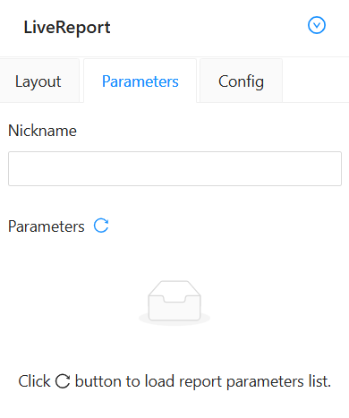
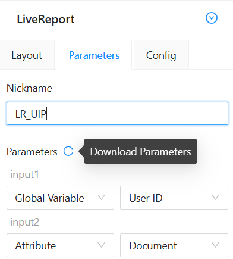

# LiveReport

The LiveReport element in UI Painter allows to incorporate tabular report data into layout.

## Drag and Drop 

Drag the **LiveReport** element to your desired location in the work area. 
This determines where the report data will be displayed.

## Data Source Configuration

The element can use the ContentServer LiveReport as a data source. 
To configure it, select the **LiveReport** element you just placed in the work area to activate it. 
Then, press the **Edit** button available for active items to open the configuration panel. 
Once there, navigate to the **Parameters** tab.

### Nickname

The "Nickname" field requires to input either the unique ID or the nickname associated with the CS LiveReport. 
Ensure the entered value matches a valid ID or existing nickname in the system.

### Parameters

To determine the LiveReport parameters press **Download Parameters** button opposite **Parameters** label.
This action will automatically download and display the report parameters.  
  
Each of the parameters is represented by a group of controls for configuration.
Each group of controls contains a label corresponding to the name of the parameter, as well as two drop-downs 
for selecting the type of the parameter value source, as well as the source of dependence on the selected type.

There are four types of parameter data sources:

- **Static**: Static data defined by the user during the configuration process.
- **Global Variable**: Global variables. Must be selected from the available list.
- **Attribute**: The source for the parameter value can be an attribute. Currently supported types:
Text, User, Item Reference.
- **Input**: The source for the parameter value can be a regular input. These elements are placed in the **Inputs** section 
among the list of draggable items. Only elements present in the template structure are available for selection.

